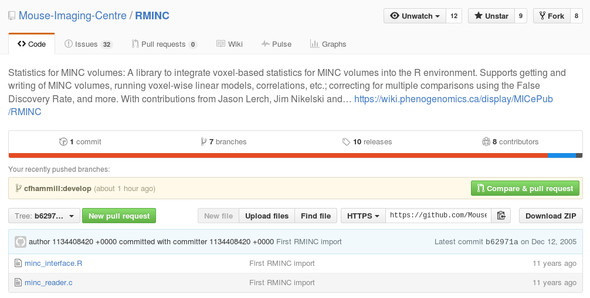
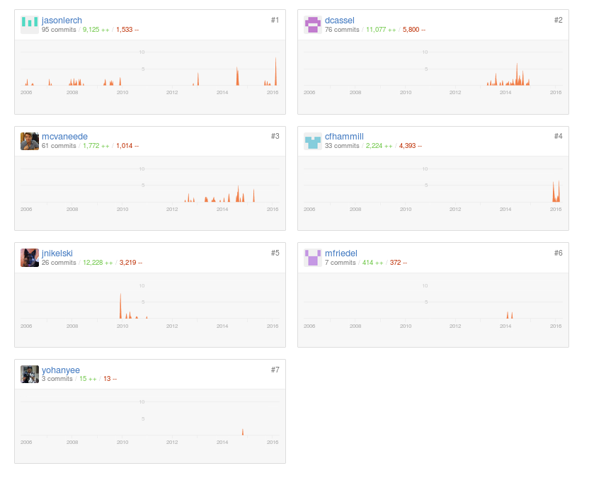
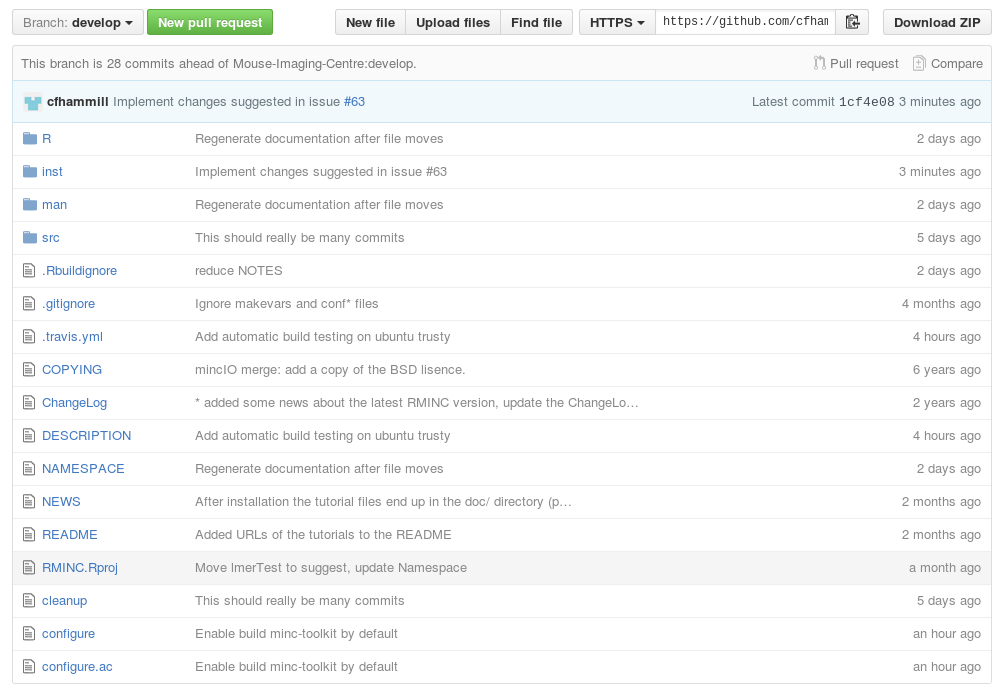
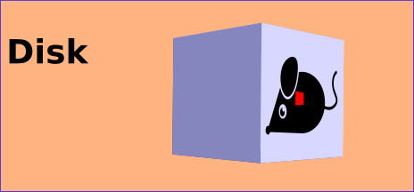
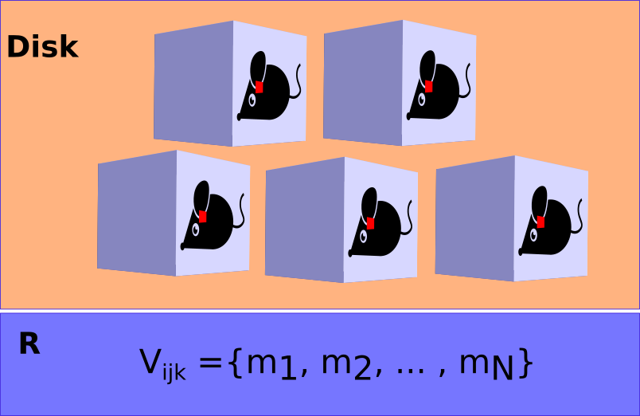
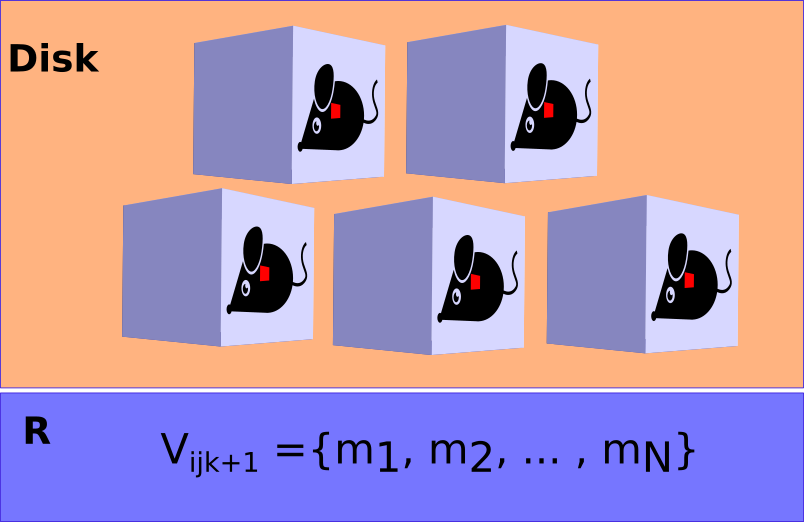
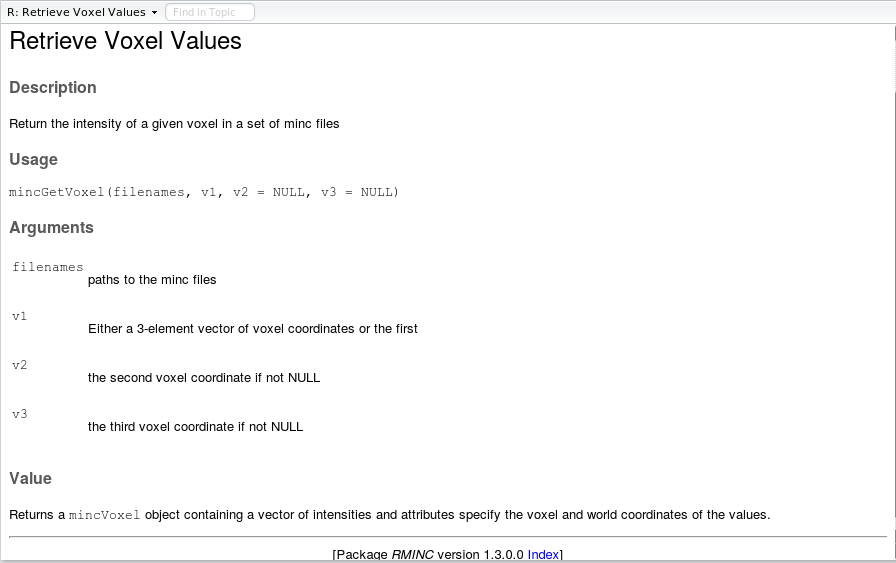

```{r, echo = FALSE, message=FALSE}
library(RMINC)
library(knitr)
```

## Roadmap

- RMINC history
- CRAN
- Software development and design
- RMINC under the hood
    - representations
    - abstractions
- Getting RMINC ready for CRAN
    - building
    - testing
    - documenting
    - standardizing
- Future Directions

## RMINC

- R interface to the world of MINC
- Statistics for minc volumes
- First commit in 2005!
- Version 1.3 released February 25th, 2016

## Inception



## Development



## Most Recent Release


## Most Recent Development Branch



## Improving accessibility
>- Visibility (be on CRAN)
>- Availability (be on CRAN)
>- Ease of install (be on CRAN)
>- \Large{Submitted Today!}

## CRAN

- The Comprehensive R Archive Network
- 8287 Packages
- Holds all major R packages
- Run by the R-project
- Pretty high standards

## Package Development
>- **Scripting vs. Software Development**
>- getting the job done vs. building a system
>- comes down to design

## Symptoms of design problems 

>- **Rigid**: \newline
   tedency for code to resist modification
>- **Fragile**: \newline
   tendency for modifications to break code in unexpected
   places
>- **Immobile**: \newline
   tendency for supposedly modular code to not work in new situations
>- **Viscous**: \newline
   tendency for hacks to be easier to implement than robust solutions[^1]
  
[^1]: Metaphors from Robert Martin

## Barriers to good design
- Cruft
- Maintaining compatibility
- Complexity
- Managing dependencies and interfacing with external code

## Refactoring
- Work to make code more understandable
- Work to make code easier to maintain
- Focus on writing small reliable functions
- Focus on composability
- Minimize global state

## Design focuses
- Design revolves around data
- **Representation**
- **Abstraction**

## RMINC
### Representations for minc files
### Abstractions for performing statistics

## Representations
- `mincSingleDim`: flat vector of intensities for single minc files
  and single value statistics tagged with metadata
- `mincMultiDim`: matrices with columns corresponding
  typically to different statistics, tagged with metadata
- `mincArray`: 3D array of intensities for a single minc file
- `mincMultiArray`?: Dimension respecting representations 
  for results modelling

## Abstraction Goals
- Facilitate movement of imaging data to and from the file system
- Facilitate the generation of useful representations
- Facilitate the fitting of statistical models
- Reduce iteration time for data exploration

## Abstraction Goals
- Facilitate movement of imaging data to and from the file system
- Facilitate the generation of useful representations
- **Facilitate the fitting of statistical models**
- **Reduce iteration time for data exploration**

## Easy Model Fitting
>- Modelling in R is typically direct
```{r, eval = FALSE}
glm(binomial_response ~ covariate1 + ... + covariateN, 
    data = data_source, 
    family = binomial )
```
>- **Challenge**: a full experiment will not fit in memory
>- **Solution**: iterate through files extracting vectors of voxel values
  those voxel values are then fit against covariates

---

[^2]



[^2]: Mouse icon made by Freepik from www.flaticon.com

---



---



## Fitting models
- Abstractions:
    - `mincLm`
    - `mincLmer`
    - `mincAnova`
    - `mincTtest` \newline
    ...
    - `mincApply`
    - `mincApplyRCPP`

## mincApplyRCPP

- R fluent interface to applying over voxels
```{r, echo = 2}
options(width = 35)
str(args(mincApplyRCPP))
```
```{r, eval = FALSE}
mincApplyRCPP(experiment_frame$filenames, sample, size = 5)
```


## Expedite fitting models
- **Challenge**: R is (generally) slow, fitting models can be slow
- **Solution**: Implement parallelism
- Abstractions:
    * `pMincApply`: General purpose parallelism 
    * `mcMincApply`: Multicore parallelism
    * `qMincApply`: Grid computing parallelism
    * `gMincApply`: Open problem

## Dealing with clusters
- Implements flexible support for multiple parallelism backends
- Integration with 'BatchJobs' package
- So far works with HPF and our local cluster, *should*
  work on scinet but it hasn't been tested
- New abstractions allow computation to performed in the background

## New Cluster Abstractions
- `qMincApply`: Turnkey function
- `qMincRegistry`: Create shared files for parallel jobs to be coordinated,
  once created, registries can be loaded from another R session or even another machine
- `qMincMap`: Split the calculation into many peices and prepare the scripts
   necessary for job submission
- `qMincReduce`: Retrieve the job results combining them into the object of your
   choice, defaults to minc statistic object like `mincMultiDim`
- Currently only performs voxel-wise calculations, but can be extended to
  more complex analyses or be used to parellelize hyper-parameter search

## Push for CRAN
- Must build automatically on two platforms
- Must perform as expected
- Must be well documented
- Must adhere to CRAN standards

## Building R Packages
- R uses a C-like build system
- Supports basic configure scripts and makevars
- Does not support cmake
- **Challenge**: Locating/Providing system dependencies
- **Solution(?)**: Using autoconf to generate a configure script
  that can flexibly locate libminc and hdf5
- if they are not found it can libminc from source with cmake and git

- **Goal**:
```{r, eval = FALSE}
install.packages("RMINC")
```
  Should work without issue on all supported platforms

## Keeping things working
- Ensuring code performs as expected is a significant problem
- Strategies exist to ensure code performs as expected

## Scale of Testing
> Optimism is an occupational hazard of programming: feedback is the treatment - Kent Beck

1. **Optimism** - "this really looks like it should work"
2. **Hand testing** - "I tried a few variants of this and they work"
3. **Assertion testing** - "I broke the problem into small pieces, and 
   had the computer check that they all work"
4. **Property testing** - "I specified rules about return values,
   the computer explores parameter space to see if rules hold"
5. **Formal proof** - "I mathematically demonstrated the program
   is correct"
   
## Scale of Testing
> Optimism is an occupational hazard of programming: feedback is the treatment - Kent Beck

1. **Optimism** - "this really looks like it should work"
2. **Hand testing** - "I tried a few variants of this and they work"
3. **Assertion testing - "I broke the problem into small pieces, and 
   had the computer check that they all work"**
4. **Property testing** - "I specified rules about return values,
   and had the computer explores parameter space to see if rules hold"
5. **Formal proof** - "I mathematically demonstrated the program
   is correct"

## Unit testing 
- Unit tests are a set of assertions about the value functions
  return.

```{r, error = TRUE}
library(testthat)
test_that("My Code Works",
           expect_equal(mean(1:5), 3))

test_that("My other code also works",
         expect_equal(sd(1:5), 1.5))
```

## RMINC Testing

- RMINC includes a tool for testing the package
```{r, eval = FALSE}
runRMINCTestbed()
```
 runs a suite of tests on our code to check that all is working as expected
 
- `runRMINCTestbed` calls out to 'test_directory' which runs all tests in
  `tests/testthat/`
  
## Integration testing


- Services provide automatic testing on multiple platforms
- Runs whenever code is changed on github
- Runs whenever a pull request is issued

## R Documentation
>- CRAN requires all user visible functions to be documented. \newline
  This is huge benefit to users as all documentation can be quickly
  accessed with the standard `?` call
>- **Challenge**: Documentation must be kept in sync with the code
>- **Solution**: Documentation lives in source with the code and
  is autogenerated each time the package is rebuilt.\newline 
>- 'roxygen2' integration with rstudio supports this


## Roxygen Documentation
```{r, eval = FALSE}
#' Retrieve Voxel Values
#' 
#' Return the intensity of a given voxel in a set of minc files
#' 
#' @param filenames paths to the minc files
#' @param v1 Either a 3-element vector of voxel coordinates 
#' or the first
#' @param v2 the second voxel coordinate if not NULL
#' @param v3 the third voxel coordinate if not NULL
#' @return Returns a \code{mincVoxel} object containing a vector
#' of intensities and attributes specify the voxel and world 
#' coordinates of the values.
#' @export
mincGetVoxel <- function(filenames, v1, v2=NULL, v3=NULL) {
```

---



## Appeasing R CMD check
- CRAN is very particular about code quality
- Luckily R CMD check tests many requirements for you
- Highlights missed arguments in documentation,
  missing global variables (helpful for catching typos)
- Ensures dependencies can be loaded properly

## Future directions
- Harden parallel code
- Add a dimension respecting results representation
- Add an experiment representation
- Add abstractions for multivariate statistics
- Things you want?

---

\centering{\Large{Ever need R help? \newline Come by my desk or drop me an email}}

---

\centering{\Large{Questions?}}
